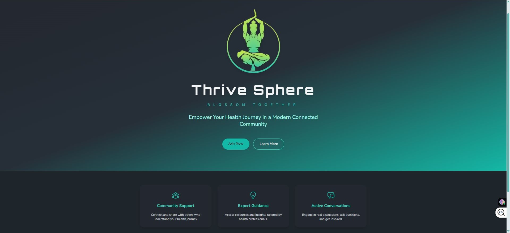
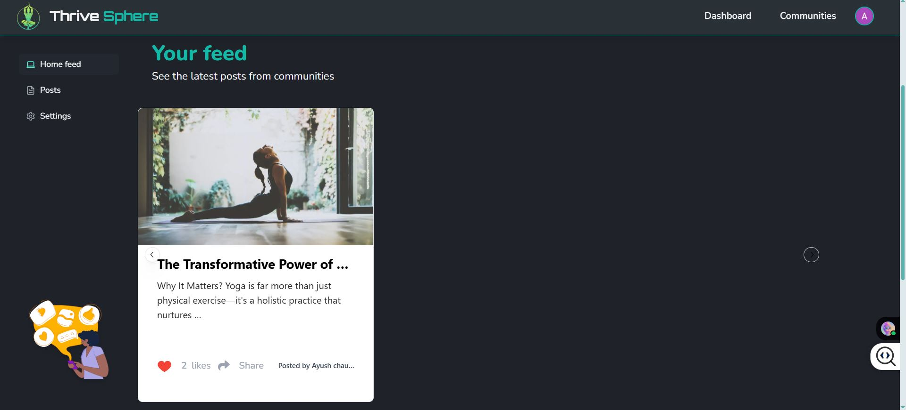
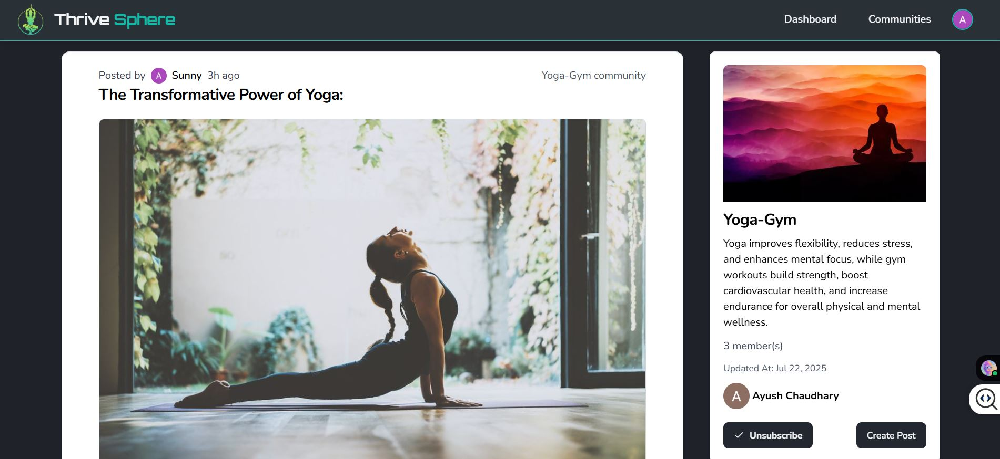

  <a href="">[![Contributors][contributors-shield]][contributors-url]</a>
  <a href="">[![Forks][forks-shield]][forks-url]</a>
  <a href="">[![Stargazers][stars-shield]][stars-url]</a>
  <a href="">[![MIT License][license-shield]][license-url]</a>

<!-- PROJECT LOGO okay -->
 

  <h3 align="center">Thrive Sphere</h3>

  

    BLOSSOM TOGETHER 
    A health-focused social media platform. 
     
    <a href="#">Visit</a>
  

<!-- TABLE OF CONTENTS -->

  
Table of Contents

  <ol>
    <li>
      <a href="#about-the-project">About The Project</a>
      <ul>
        <li><a href="#built-with">Built With</a></li>
      </ul>
    </li>
    <li>
      <a href="#getting-started">Getting Started</a>
      <ul>
        <li><a href="#prerequisites">Prerequisites</a></li>
        <li><a href="#installation">Installation</a></li>
      </ul>
    </li>
    <li><a href="#usage">Usage</a></li>
    <li><a href="#roadmap">Roadmap</a></li>
    <li><a href="#contributing">Contributing</a></li>
    <li><a href="#license">License</a></li>
    <li><a href="#contact">Contact</a></li>
    <li><a href="#acknowledgments">Acknowledgments</a></li>
  </ol>

<!-- ABOUT THE PROJECT -->

## About The Project

Empowering your journey to better health through knowledge sharing and supportive connections.

>
> 
> 
> 

### Built With

- 
- 
- 
- 
- 

(<a href="#readme-top">back to top</a>)

<!-- GETTING STARTED -->

## Getting Started

To get a local copy up and running, follow these simple steps.

### Prerequisites

- Node.js (LTS)
- npm (v7+)
- MongoDB instance

### Installation

1. Clone the repo
2. Install NPM packages
3. Create a `.env` file based on `.env.example` and add your variables
4. Run the app

(<a href="#readme-top">back to top</a>)

## Usage

Describe some core workflows or add GIF/image demos for signing up, joining communities, posting, etc.

## Roadmap

- [x] Add README
- [ ] Meta tags for each page
- [ ] Report button
- [ ] OTP verification in auth
- [ ] Tools for content moderation

See the [open issues][issues-url] for a full list of proposed features and known issues.

(<a href="#readme-top">back to top</a>)

## Contributing

Contributions make the open source community such an amazing place to learn, inspire, and create. Any contributions you make are **greatly appreciated**.

If you have a suggestion, please fork the repo and create a pull request. You can also open an issue with the tag "enhancement". Don't forget to star the project!

1. Fork the Project
2. Create your Feature Branch (`git checkout -b feature/AmazingFeature`)
3. Commit your Changes (`git commit -m 'Add some AmazingFeature'`)
4. Push to the Branch (`git push origin feature/AmazingFeature`)
5. Open a Pull Request

(<a href="#readme-top">back to top</a>)

## License

Distributed under the MIT License. See `LICENSE.txt` for more information.

(<a href="#readme-top">back to top</a>)

## Contact

Ayush Chaudhary  
[GitHub](https://github.com/Ayush-Chaudhary13)

Project Link: [https://github.com/Ayush-Chaudhary13/thrive-sphere](https://github.com/Ayush-Chaudhary13/thrive-sphere)

(<a href="#readme-top">back to top</a>)

<!-- ACKNOWLEDGMENTS -->
<!-- Add credits, libraries, or thanks here as you develop the project further -->

<!-- MARKDOWN LINKS & IMAGES -->
<!-- https://www.markdownguide.org/basic-syntax/#reference-style-links -->

[contributors-shield]: https://img.shields.io/github/contributors/Ayush-Chaudhary13/thrive-sphere.svg?style=for-the-badge
[contributors-url]: https://github.com/Ayush-Chaudhary13/thrive-sphere/graphs/contributors
[stars-shield]: https://img.shields.io/github/stars/Ayush-Chaudhary13/thrive-sphere.svg?style=for-the-badge
[stars-url]: https://github.com/Ayush-Chaudhary13/thrive-sphere/stargazers
[forks-shield]: https://img.shields.io/github/forks/Ayush-Chaudhary13/thrive-sphere.svg?style=for-the-badge
[forks-url]: https://github.com/Ayush-Chaudhary13/thrive-sphere/network/members
[license-shield]: https://img.shields.io/github/license/Ayush-Chaudhary13/thrive-sphere.svg?style=for-the-badge
[license-url]: https://github.com/Ayush-Chaudhary13/thrive-sphere/blob/main/LICENSE.txt
[issues-url]: https://github.com/Ayush-Chaudhary13/thrive-sphere/issues
